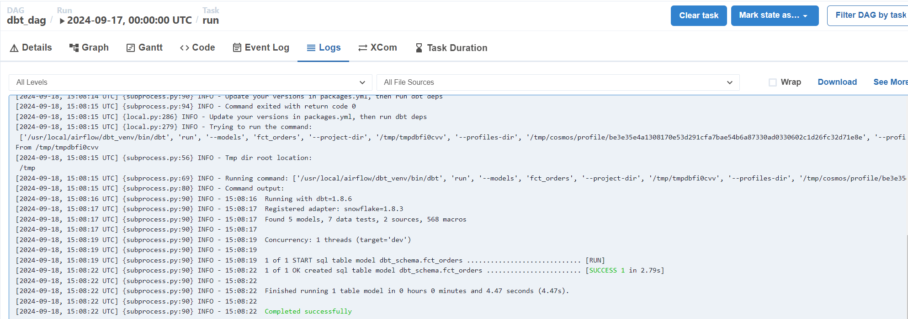

Purpose
=======
The purpose of this project was to explore connecting and deploying these technologies. While I have experience with platforms like Databricks and I wanted to handle modeling and testing on dbt, using Snowflake as a warehouse and Airflow for scheduling. 

Data
====
The data comes from the Snowflake sample dataset TPCH-SF1, tables ORDERS and LINEITEMS. I created the modeling chart below to show the relationships between the original source tables, the staging tables, and finally the data marts.

The Snowflake Warehouse,Databse,Schema:

And this is the DAG execution sequence of the job on from Airflow.

Business Problems Addressed
===========================
- Reduced redundancy with resusable functions ( Macros ) in dbt.
- Automated validity with general and specific test to check for unique values for ids, dates within the appropriate range, null values, and checking for negative discount prices. 

Astro-Airflow-Docker
====================
The project is running on the astro CLI. Astro is used as a layer on top of Airflow to streamline connections to data sources, databases, cloud platform, and pipeline tasks. More info and Astronomer set-up below. The end result is docker images for the different aspects of a project. 

  
Astro

  
Overview
========

Welcome to Astronomer! This project was generated after you ran 'astro dev init' using the Astronomer CLI. This readme describes the contents of the project, as well as how to run Apache Airflow on your local machine.

Project Contents
================

Your Astro project contains the following files and folders:

- dags: This folder contains the Python files for your Airflow DAGs. By default, this directory includes one example DAG:
    - `example_astronauts`: This DAG shows a simple ETL pipeline example that queries the list of astronauts currently in space from the Open Notify API and prints a statement for each astronaut. The DAG uses the TaskFlow API to define tasks in Python, and dynamic task mapping to dynamically print a statement for each astronaut. For more on how this DAG works, see our [Getting started tutorial](https://www.astronomer.io/docs/learn/get-started-with-airflow).
- Dockerfile: This file contains a versioned Astro Runtime Docker image that provides a differentiated Airflow experience. If you want to execute other commands or overrides at runtime, specify them here.
- include: This folder contains any additional files that you want to include as part of your project. It is empty by default.
- packages.txt: Install OS-level packages needed for your project by adding them to this file. It is empty by default.
- requirements.txt: Install Python packages needed for your project by adding them to this file. It is empty by default.
- plugins: Add custom or community plugins for your project to this file. It is empty by default.
- airflow_settings.yaml: Use this local-only file to specify Airflow Connections, Variables, and Pools instead of entering them in the Airflow UI as you develop DAGs in this project.

Deploy Your Project Locally
===========================

1. Start Airflow on your local machine by running 'astro dev start'.

This command will spin up 4 Docker containers on your machine, each for a different Airflow component:

- Postgres: Airflow's Metadata Database
- Webserver: The Airflow component responsible for rendering the Airflow UI
- Scheduler: The Airflow component responsible for monitoring and triggering tasks
- Triggerer: The Airflow component responsible for triggering deferred tasks

2. Verify that all 4 Docker containers were created by running 'docker ps'.

Note: Running 'astro dev start' will start your project with the Airflow Webserver exposed at port 8080 and Postgres exposed at port 5432. If you already have either of those ports allocated, you can either [stop your existing Docker containers or change the port](https://www.astronomer.io/docs/astro/cli/troubleshoot-locally#ports-are-not-available-for-my-local-airflow-webserver).

3. Access the Airflow UI for your local Airflow project. To do so, go to http://localhost:8080/ and log in with 'admin' for both your Username and Password.

You should also be able to access your Postgres Database at 'localhost:5432/postgres'.

Deploy Your Project to Astronomer
=================================

If you have an Astronomer account, pushing code to a Deployment on Astronomer is simple. For deploying instructions, refer to Astronomer documentation: https://www.astronomer.io/docs/astro/deploy-code/

Contact
=======

The Astronomer CLI is maintained with love by the Astronomer team. To report a bug or suggest a change, reach out to our support.

Results
=======
The scheduling is mostly setup in the `dbt_dag.py` file. After runs you can checkout the logs through the DAG cycle:

